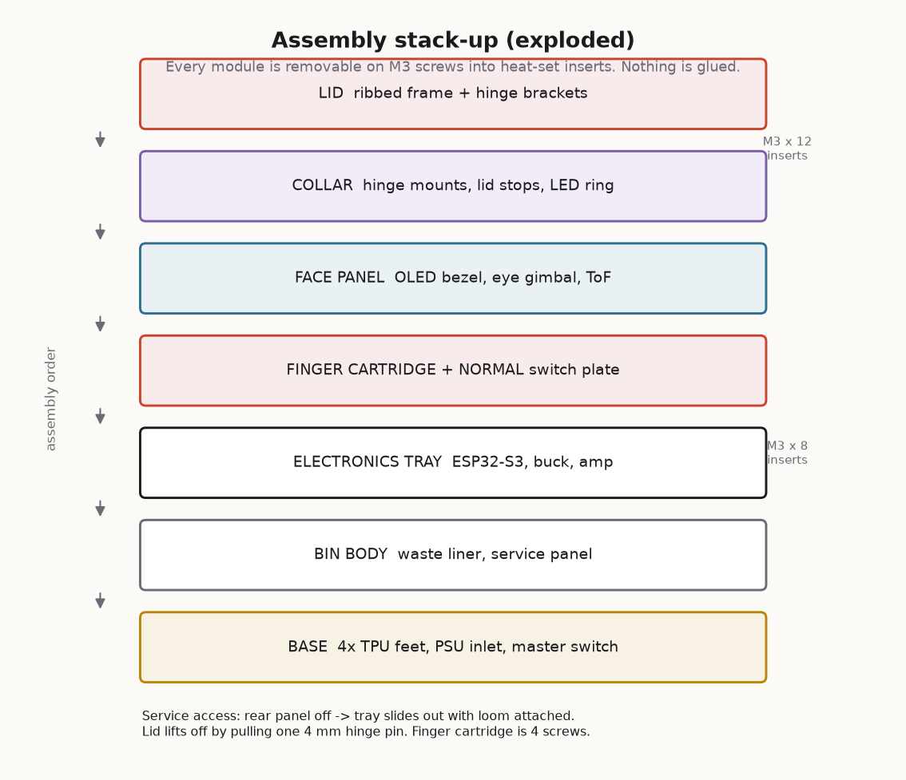

# CAD

All 24 custom parts, as parametric OpenSCAD.

Open <https://openscad.org/> — or render from the command line:

```bash
openscad -o lid_frame.stl -D 'part="lid_frame"' cad/lid_mechanism.scad
```

`cad/binchad_params.scad` holds every shared dimension. Change a number there
and every part that references it follows. That is the entire point: the lid
width appears in the hinge, the servo mount, the linkage length and the body
cut-out, and they must not be allowed to disagree.



---

## 1. The torque budget

**Do this sum before you buy a servo. Do it again if you change the lid.**

```
tau_static = m · g · d · cos(theta)          worst case at theta = 0 (lid horizontal)

    m  = lid mass, including hinge hardware ........ 0.180 kg   ← WEIGH YOURS
    g  = 9.81 m/s²
    d  = hinge axis to centre of gravity ........... 0.110 m

tau_static = 0.180 × 9.81 × 0.110 = 0.194 N·m = 1.98 kgf·cm

required   = tau_static × safety factor (2.0) = 3.96 kgf·cm
fitted     = MG996R @ 5 V = 9.4 kgf·cm

margin     = 4.7 ×
```

The margin is generous on purpose. It covers a stiff hinge, a cold servo, a
sagging 5 V rail, and somebody resting a hand on the lid.

**If your lid is heavier**, recompute and move up: DS3218 is 20 kgf·cm, DS3225
is 25. **Do not fit an SG90** (1.8 kgf·cm) and hope. It will not lift the lid,
it will strip its own gears trying, and it will do so during the demo.

The ribbed `lid_frame` exists to keep `m` down. A solid 5 mm lid of the same
footprint is over 400 g, needs 4.4 kgf·cm static, and would push you to a
DS3218 and a bigger power supply for no benefit.

### Where the servo actually sits

The design uses a **two-bar linkage**, not a servo horn bolted to the hinge.
That puts the servo low in the body (better mass distribution, shorter power
run) and lets you trim the effective lever arm on assembly by moving the
linkage anchor. `link_len` is 62 mm nominal — expect to adjust it once. The
slotted holes in `servo_mount` exist for exactly this.

---

## 2. Part index

### `lid_mechanism.scad`

| `part=` | Qty | Material | Notes |
|---|---:|---|---|
| `hinge_body` | 2 | PETG | Carries the full lid load. 4 perimeters, 40 % infill minimum. |
| `hinge_lid` | 2 | PETG | Same. |
| `lid_frame` | 1 | PLA or PETG | Print **top-face-down**. No supports. |
| `servo_mount` | 1 | PETG | Slotted holes for linkage trimming. |
| `linkage` | 1 | PETG | **100 % infill.** 4 mm thick, carries the whole lid load. |
| `lid_stop` | 2 | PETG | Hard end stop. Firmware bugs cannot drive past it. |
| `lid_stop_pad` | 2 | **TPU** | The bumper that stops the clack. |

### `finger_module.scad`

| `part=` | Qty | Material | Notes |
|---|---:|---|---|
| `box` | 1 | PETG | Print open-face-down. |
| `door` | 1 | PLA | The hatch. |
| `finger` | 1 | PLA | Oversized on purpose. |
| `finger_tip` | 1 | **TPU** | Soft contact with the switch — see §3. |
| `servo_plate` | 1 | PETG | Carries both micro servos. |
| `faceplate` | 1 | PLA | Recessed label panel for an inlay or sticker. |

### `eye_and_sensors.scad`

| `part=` | Qty | Material | Notes |
|---|---:|---|---|
| `eye_ball` | 1 | PLA, **matte** | Back is flattened so it prints without supports. |
| `eye_lens` | 1 | **clear PETG**, 3 perimeters, 0 % infill | Or buy a 26 mm acrylic dome. |
| `eye_yoke` | 1 | PETG | Tilt axis. |
| `eye_pan_base` | 1 | PETG | Pan servo cradle. |
| `tof_bracket` | 2 | PLA | 4 mm standoff — see §3. |
| `oled_bezel` | 1 | PLA | |

### `chassis_and_tray.scad`

| `part=` | Qty | Material | Notes |
|---|---:|---|---|
| `tray` | 1 | PETG | ESP32-S3 hole pattern + 10 mm utility grid. |
| `tray_rails` | 2 | PETG | The tray slides out on these. |
| `button_plate` | 1 | PETG | NORMAL MODE switch. Includes a finger-reach witness mark. |
| `service_panel` | 1 | PLA | Rear access, with a USB-C cut-out so you can reflash without opening. |
| `foot` | 4 | **TPU**, 30 % infill | Should squash a little. |
| `led_diffuser` | 1 | clear/white PLA | Channel for a 10 mm WS2812 strip. |
| `speaker_grille` | 1 | PLA | |

### `remote_enclosure.scad`

| `part=` | Qty | Material | Notes |
|---|---:|---|---|
| `shell` | 1 | PLA | 190 × 110 × 34 mm. Deliberately too big for one hand. |
| `faceplate` | 1 | PLA | All button holes + recessed label panels. |
| `cap_round` | 7 | PLA | D-pad, OK, OPEN, CLOSE. |
| `cap_danger` | 1 | **red** PLA | Does nothing useful. Essential. |
| `antenna` | 1 | PLA | Electrically inert. The C3's real antenna is a PCB trace. |
| `battery_door` | 1 | PLA | |

**24 distinct parts, 33 pieces total.**

---

## 3. Three details that matter more than they look

**The ToF standoff.** `tof_bracket` holds the VL53L0X 4 mm proud of the
mounting face, with a window wider than the PCB. A bracket that shadows the
emitter is the single most common cause of *"the sensor reads 8190 forever"*.
Do not close that window up to look neater.

**The TPU finger tip.** At `FINGER_ANGLE_PRESS` (112°) the tip lands roughly
6 mm **past** the switch face. The overshoot is deliberate: it guarantees the
switch is fully thrown even with assembly slop. The TPU absorbs it, so the
servo stalls softly instead of stripping its gears on a switch that has already
bottomed out. Print the tip soft, and do not substitute rigid plastic.

**The finger-reach witness mark.** `button_plate` prints a 0.4 mm proud ring
showing where the finger tip should land. Check it during dry assembly
(`BUILD_GUIDE.md` §5), then sand it off. `finger_reach = finger_len + 6` in the
SCAD source is the number to verify against your actual geometry.

---

## 4. Print settings

| | Structural (PETG) | Cosmetic (PLA) | Soft (TPU) |
|---|---|---|---|
| Layer height | 0.20 mm | 0.20 mm | 0.20 mm |
| Perimeters | 4 | 3 | 3 |
| Infill | 40 % gyroid | 20 % gyroid | 30 % gyroid |
| Supports | only `eye_yoke` | none | none |
| Nozzle | 0.4 mm | 0.4 mm | 0.4 mm |
| Speed | 45 mm/s | 60 mm/s | 20 mm/s |

Exceptions: `linkage` at 100 % infill. `hinge_body` / `hinge_lid` at 40 %
minimum — they carry the lid.

**Total print time** for the full set is roughly 34 hours and about 620 g of
filament. The `lid_frame` alone is ~9 hours; start it first.

### Tolerances

`binchad_params.scad` defines three fits, all measured on a stock
Ender-class printer:

```
fit_snug  = 0.15   press fit — a pin in a bracket
fit_loose = 0.35   free rotation — the hinge pin in its bore
fit_clear = 0.60   a panel in a slot, a cable through a hole
```

If your holes come out tight, **raise `fit_loose`** — do not scale whole
parts, which throws off every screw hole simultaneously.

---

## 5. Serviceability rules

These are design constraints, not suggestions. They are why the machine is
fixable at 3 a.m. with ten minutes to go.

- **Heat-set inserts everywhere a screw enters plastic more than once.**
  M3 × 5.0 mm brass. `insert_boss()` prints the bore undersize on purpose —
  the brass melts its own interference fit.
- **Nothing is glued.** Not the electronics, not the sensors, not the eye.
- **The electronics tray slides out of the back** with the loom still
  attached, on `tray_rails`.
- **The lid lifts off** by pulling one 4 mm hinge pin. No disassembly of
  anything else.
- **The finger cartridge is four screws** and one connector. It is the part
  most likely to be broken by an enthusiastic audience, so it is the part
  designed to be swapped fastest — print a spare.
- **The service panel has a USB-C cut-out.** You can reflash without opening
  the bin.

---

## 6. Retrofitting a bought bin

The reference build wraps a 210 × 210 mm square opening. To fit yours:

1. Measure the opening. Set `bin_opening_x`, `bin_opening_y`.
2. Set `lid_x` / `lid_y` to opening + 4 mm overhang.
3. **Weigh the lid you end up with**, set `lid_mass_g`, and balance it on a
   ruler to find `lid_cog_mm`.
4. Redo the torque sum in §1. Confirm your servo still has ≥ 2× margin.
5. Set `hinge_span` to something your lid can actually support — roughly
   70 % of the lid width.
6. Re-render everything. Dry-fit before you print the second copy of anything.

Round bins work too, but you will need to replace the collar profile; the
hinge, servo mount, linkage and finger cartridge are all independent of the
body shape.

---

## 7. Safety constraints baked into the geometry

- **No sharp edges anywhere a user can reach.** The finger tip is a TPU
  sphere. The faceplate and lid edges are chamfered or filleted.
- **Hard mechanical stops at both ends of lid travel** (`lid_stop`), so a
  firmware fault cannot drive the lid into the body or past vertical.
- **The finger is low-torque by design** — an SG90 at 1.8 kgf·cm on a 58 mm
  arm cannot generate a pinch force that matters, and it stalls harmlessly.
- **No projectiles, no blades, no heating elements, no mains voltage inside
  the enclosure.** The only mains connection is a sealed, certified PSU.
