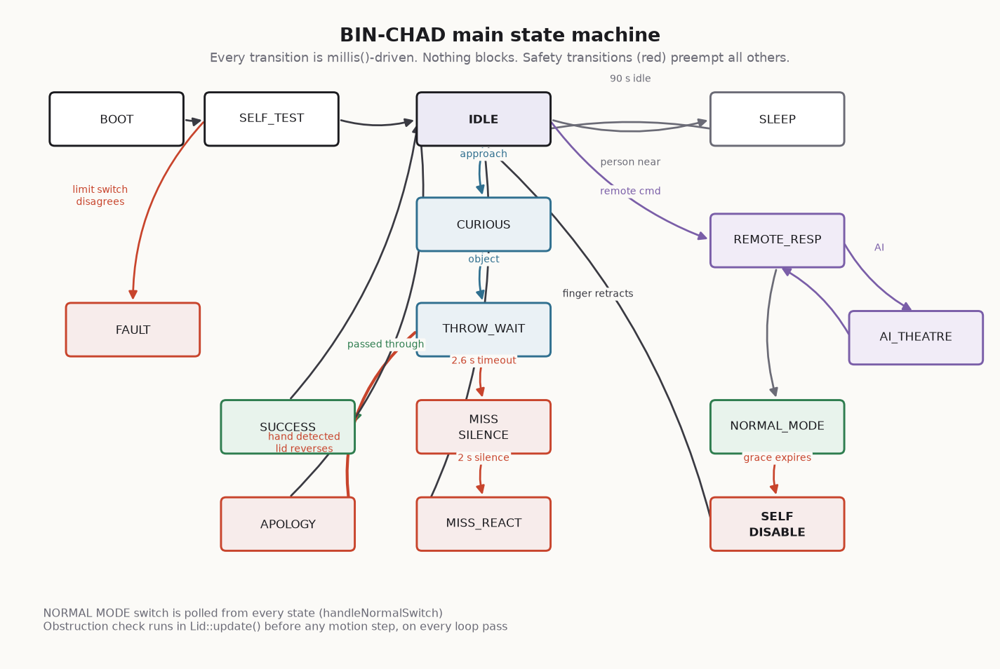

# FIRMWARE

Two sketches, one shared protocol header, no external state.



---

## 1. Toolchain

| | Bin | Remote |
|---|---|---|
| Sketch | `firmware/BinChad/BinChad.ino` | `firmware/BinRemote/BinRemote.ino` |
| Board | ESP32S3 Dev Module | ESP32C3 Dev Module |
| Core | Arduino-ESP32 **3.x** | Arduino-ESP32 **3.x** |
| USB CDC On Boot | **Enabled** | **Enabled** (mandatory — GPIO20/21 are buttons) |
| Flash size | match your module (8/16 MB) | 4 MB |
| Partition | any scheme with a SPIFFS/LittleFS partition | default |
| PSRAM | match your module (OPI for N16R8) | — |

Arduino-ESP32 core: <https://github.com/espressif/arduino-esp32>
Reference docs: <https://docs.espressif.com/projects/arduino-esp32/en/latest/>

### Libraries

| Library | Used for | Source |
|---|---|---|
| ESP32Servo | All five servos | <https://github.com/madhephaestus/ESP32Servo> |
| Adafruit VL53L0X | Both ToF sensors | <https://github.com/adafruit/Adafruit_VL53L0X> |
| Adafruit SSD1306 | OLED | <https://github.com/adafruit/Adafruit_SSD1306> |
| Adafruit GFX | OLED primitives | <https://github.com/adafruit/Adafruit-GFX-Library> |
| Adafruit NeoPixel | WS2812B | <https://github.com/adafruit/Adafruit_NeoPixel> |
| ESP_I2S | I²S audio (built into core 3.x) | part of Arduino-ESP32 |
| esp_now | Remote link (built into core) | <https://developer.espressif.com/blog/2024/08/arduino-esp-now-lib/> |

All are actively maintained. `LittleFS`, `WiFi`, `Wire` and `esp_now` ship with
the core.

> **Core 2.x users:** the ESP-NOW receive callback signature and `ESP_I2S.h`
> both changed in core 3.0. The firmware detects this
> (`ESP_ARDUINO_VERSION_MAJOR`, `__has_include`) and still compiles, but audio
> falls back to silent. Set `AUDIO_BACKEND` to `AUDIO_DFPLAYER` if you are
> stuck on 2.x and want sound.

### Uploading the sound files

The I²S build streams 16-bit mono WAV files from LittleFS.

```bash
python tools/make_wavs.py          # writes placeholder clips to firmware/BinChad/data/
```

Then in Arduino IDE: **Tools → ESP32 Sketch Data Upload**
(install <https://github.com/lorol/arduino-esp32fs-plugin> first), or:

```bash
arduino-cli ... --build-property build.partitions=default
mklittlefs -c firmware/BinChad/data -s 1572864 littlefs.bin
esptool.py --chip esp32s3 write_flash 0x290000 littlefs.bin   # check YOUR partition offset
```

Replace the placeholders with real recordings whenever you like — same
filenames, 16-bit mono PCM, 22 050 Hz, **under one second each**. A missing
file is not an error; that clip is simply silent.

---

## 2. Module map

```
firmware/BinChad/
  BinChad.ino                 setup() + loop(). Calls update() on everything, every pass.
  data/                       WAV clips -> LittleFS
  src/
    config/
      pins.h                  GPIO map. Also documents the pins you must not use.
      settings.h              EVERY tunable number. Timings, angles, thresholds, weights.
    hardware/
      sensors.{h,cpp}         Dual VL53L0X + debounced switches. Degrades, never dies.
      lid.{h,cpp}             Eased motion, obstruction abort, limit-switch verification.
      eye.{h,cpp}             Pan/tilt saccades, blink, jitter, sleep.
      uselessFinger.{h,cpp}   The hatch + finger sequence, with press verification.
      leds.{h,cpp}            Eleven WS2812 patterns, frame-driven.
      audio.{h,cpp}           I2S WAV streaming / DFPlayer / silent. Chunked, non-blocking.
    ui/
      display.{h,cpp}         SSD1306 face, text, progress bar, self-test screen.
    remote/
      protocol.h              SHARED with the remote. Packet structs + checksum.
      remote.{h,cpp}          ESP-NOW receive, ring buffer, de-duplication, ACK.
    personality/
      personality.{h,cpp}     Mood machine, counters, escalation, lines, mistranslation.
    behavior/
      behaviorManager.{h,cpp} The top-level state machine. The ONLY module that commands hardware.
```

### The two architectural rules

**1. One actuation site.** `behaviorManager.cpp` is the only file that calls
`lid.open()`, `finger.deploy()`, and so on. Sensors sense, personality decides,
behaviour acts. This is what makes the safety argument tractable: there is
exactly one file to audit for *"what can make the lid move"*.

**2. Nothing blocks.** No `delay()` after `setup()`. Every module exposes
`begin()` and `update()`, and `update()` does at most one step of work before
returning. If you add a `delay()` to `loop()`, the lid stops checking for
fingers for that long, which is the one thing it must never do.

---

## 3. How a throw is processed

```
sensors.update()          ToF sample -> hysteresis -> objectInThroat edge
        ↓
behavior.handleSensors()  IDLE + person -> CURIOUS ("OH NO.")
        ↓                 CURIOUS + object -> startThrowResponse()
        ↓
startThrowResponse()      eye looks into the bin, lid.holdOpenFor(3000),
                          LEDs to ALERT, "TRASH DETECTED", enter ST_THROW_WAIT
        ↓
ST_THROW_WAIT             _throatWasBlocked latches when the object passes the beam.
                          Blocked -> then clear  = it went in       -> reactSuccess()
                          2.6 s with no block    = you missed       -> reactMiss()
                          hidden trigger pressed = it went in, honestly -> reactSuccess()
        ↓
reactMiss()               lid closes, eye locks onto the thrower, LEDs idle,
                          and then NOTHING happens for two full seconds
        ↓
ST_MISS_SILENCE (2000 ms) the pause is the joke. Resist shortening it.
        ↓
ST_MISS_REACT             personality.missLine(), SND_MISS, red flash
```

Success is detected as **blocked → clear**, not merely "something is close".
A hand held over the opening blocks the beam without ever clearing it, so it
reads as neither a success nor a miss — which is correct.

---

## 4. Safety implementation

Three independent mechanisms, in order of how fast they act:

| Layer | Where | Response |
|---|---|---|
| Obstruction abort | `Lid::update()`, first statement | Checked before any motion step on every loop pass. Stops the close, reverses to open, sets an event flag. |
| Endpoint verification | `Lid::finishMove()` | The servo claims it arrived; the limit switch decides. Disagreement for `LID_LIMIT_TIMEOUT_MS` raises `LID_ERROR` and detaches the servo rather than grinding. |
| Rail cutoff | `Lid::emergencyStop()`, GPIO38 | Drops the servo supply entirely. Default state at reset is **off**. |

Plus the motion profile itself: `ease()` is a cosine ease-in-out with zero
velocity at both endpoints, and `LID_MS_CLOSE` (900 ms) is more than twice
`LID_MS_OPEN` (380 ms). Even `LID_SPEED_ANGRY` runs through the same easing and
the same obstruction check — angry is 220 ms of *eased* travel, not a slam.

The hand-detect input is deliberately **OR-ed** across the ToF and the IR beam
(`Sensors::handInDangerZone()`). If either channel thinks there is a hand in
there, there is a hand in there. Comedy does not get a vote on that function.

After `LID_MAX_RETRIES` blocked closes, the lid gives up and stays **open**.
Failing open is the safe direction for a lid.

---

## 5. The personality engine

`personality.cpp` owns the mood state machine, five counters, and the line
tables. It commands no hardware.

**Escalation** is driven by `missCount` and an `anger` accumulator (0–100,
+14 per miss, −1 every 1.5 s, halved by an obstruction because the bin feels
genuinely bad about that one):

| Trigger | Result |
|---|---|
| 1st–2nd miss | Standard line: *"You missed." / "Almost."* |
| 3rd miss (`MISS_ANNOY_AT`) | 55 % chance of the annoyed table: *"Again?"* |
| 5th miss (`MISS_CONCERN_AT`) | State → `P_SARCASTIC` |
| 10th miss (`MISS_ANGRY_AT`) or anger ≥ 85 | State → `P_ANGRY`: red strobe, narrowed eye, *"ENOUGH."* |
| 20 s in ANGRY with anger < 40 | Cools back to IDLE |

**Determinism.** Line choice and mistranslation both come from a seeded
xorshift32 (`Personality::rnd()`), not `rand()`. The seed is derived from the
board's MAC, so it is stable across reboots of the same board and different
between two bins in the same room. A given demo replays identically, and a bug
is reproducible. `pick()` additionally never returns the same line twice
consecutively.

---

## 6. Tuning

Everything worth changing is in `src/config/settings.h`. The values you will
actually touch:

| Symbol | Default | Change it when |
|---|---:|---|
| `LID_ANGLE_CLOSED` / `LID_ANGLE_OPEN` | 12 / 96 | Always — these are per-build. See `BUILD_GUIDE.md` §7.1. |
| `LID_INVERT` | false | Your linkage mirrors the reference. |
| `LID_MS_CLOSE` | 900 | The close feels rushed, or too slow to be funny. |
| `TOF_THROAT_OBJECT_MM` | 200 | Your bin's throat is deeper/shallower than 260 mm. |
| `SAFETY_HAND_MM` | 130 | **Rarely.** Raising it makes the lid more cautious; lowering it makes it less safe. |
| `THROW_WINDOW_MS` | 2600 | People are throwing from further away. |
| `MISS_SILENCE_MS` | 2000 | Never. Two seconds is correct. |
| `SLEEP_AFTER_MS` | 90 000 | The bin naps during your demo. |
| `LED_BRIGHTNESS` | 90 | The venue is bright, or your 5 V rail is sagging. |
| `AUDIO_VOLUME_DEFAULT` | 18 | The room is loud. |

Compile-time switches at the top of the same file: `AUDIO_BACKEND`,
`USE_EYE_TILT`, `USE_TOF_APPROACH`, `USE_IR_THROAT`, `USE_NORMAL_LAMP`. All
five can be turned off and the machine still runs — useful for staged bring-up.

---

## 7. Debugging

The serial console prints a heartbeat every 5 s:

```
[hb] IDLE/IDLE lid=0 ang=0 frus=0 thr=8190mm app=1240mm cyc=37 rx=412
      │    │     │      │      │      │           │          │     └ ESP-NOW packets accepted
      │    │     │      │      │      │           │          └ lid open/close cycles
      │    │     │      │      │      │           └ approach ToF (8190 = out of range)
      │    │     │      │      │      └ throat ToF
      │    │     │      │      └ remote frustration 0..12
      │    │     │      └ anger 0..100
      │    │     └ LidState enum
      │    └ PersonalityState
      └ MainState
```

A frozen heartbeat means a hung `loop()`. A heartbeat that keeps ticking while
nothing moves means a hung mechanism — which is a much better problem to have
at 3 a.m., and is exactly why the heartbeat exists.

Other useful lines: `[remote] asked OPEN -> doing CLOSE`,
`[lid] obstruction detected - aborting close`,
`[lid] endpoint 96 not confirmed by limit switch`,
`[sensors] THROAT ToF did not answer`.
