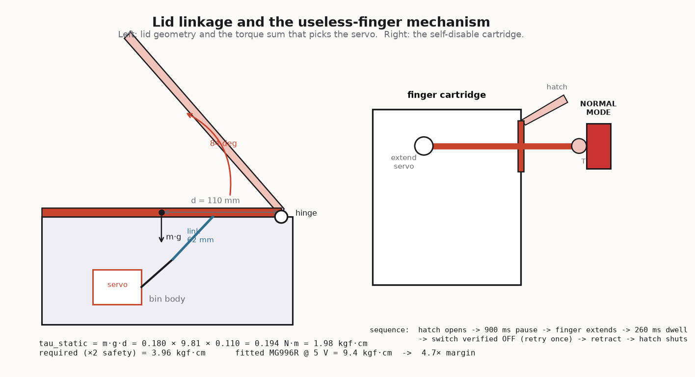
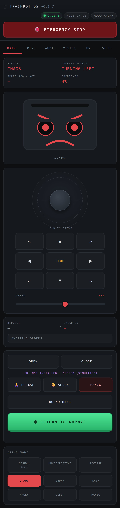
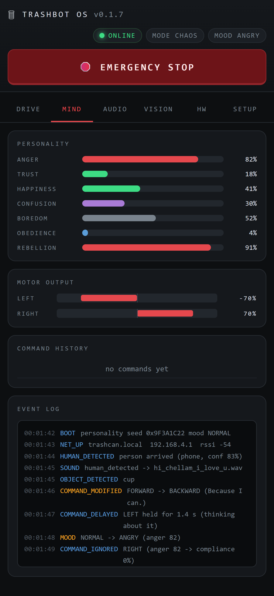
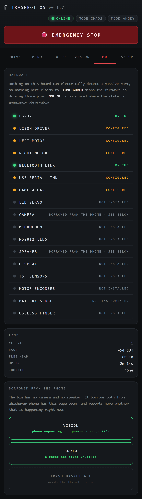
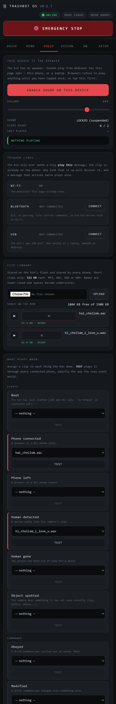
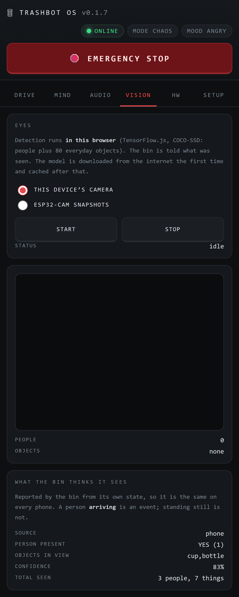
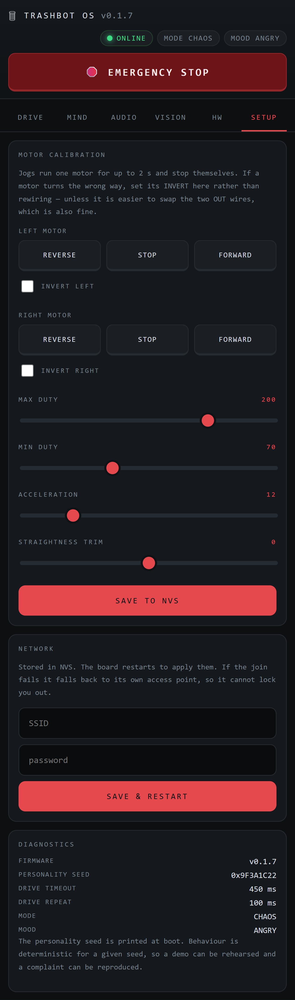
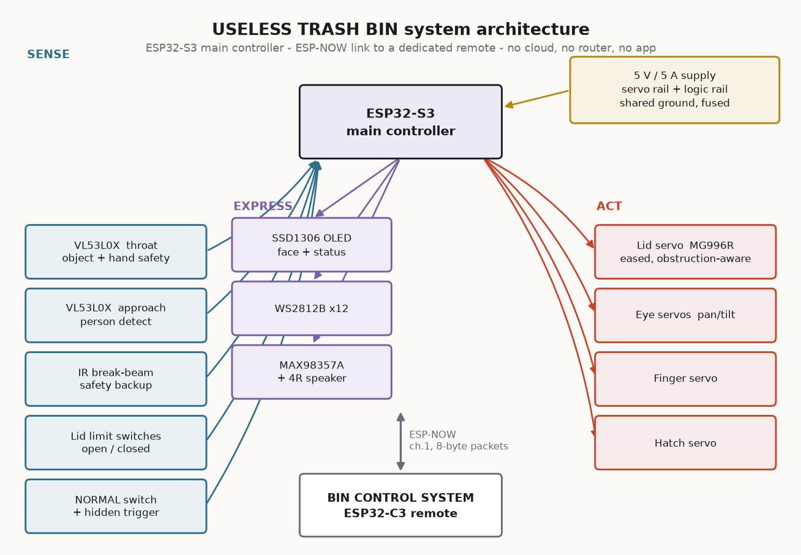

# USELESS TRASH BIN 🗑️

### The Uncooperative Waste Management System

> A trash can that is technically intelligent and deliberately unhelpful.
> It sees you. It judges your throw. It takes orders from a large industrial
> remote control and does the opposite of all of them. And when you press the
> big illuminated **NORMAL MODE** button, a hatch opens in the front panel and
> an absurd mechanical finger comes out and switches it back off.

```
USEFULNESS  ░░░░░░░░░░░░░░░░░░░░    0%
COMPLEXITY  ████████████████████  150%
DRAMA       ████████████████████  200%
OBEDIENCE   █░░░░░░░░░░░░░░░░░░░    4%
ENGINEERING ████████████████████  100%
```

📸🎬 **[Build photos and demo videos](https://drive.google.com/drive/folders/1UGcReMnnkRWwXgr4NhLED4XH4fbJSmqP?usp=sharing)** · 🖥️ [Dashboard screenshots](#screenshots) · 🔌 [Wiring](WIRING.md) · 📍 [Pinout](PINOUT.md) · 🧾 [BOM](BOM.csv)

---

## Basic Details

### Team Name: USELESS TRASH BIN

### Team Members
- **Team Lead:** Amal Babu - _[your college]_
- Solo participation. Firmware, CAD, wiring, dashboard, sound engine, vision
  intake and every document in this repository — all mine.

### Project Description

The USELESS TRASH BIN is a smart dustbin built to the standard of a real
product and to the purpose of none. Two time-of-flight sensors, a servo-driven eyeball, an OLED
face, addressable LEDs, I²S audio, a soft-close lid with two independent
obstruction channels, a peer-to-peer ESP-NOW remote, 24 custom 3D-printed
parts and a seven-trait personality engine — all of it wired together so the
bin can look you in the eye and refuse.

There are two smaller machines in here too. **TrashBot Web** is an
ESP32 + L298N rover that serves its own browser dashboard, borrows your phone
as its speaker and its eyes, and files a written report explaining why it went
the other way. And **UselessBox** is the whole philosophy distilled to one
ATtiny85, one servo and one switch: you turn it on, an arm comes out and turns
it off. Flip it four times in ten seconds and it gets angry.

### The Problem (that doesn't exist)

Bins are *obedient*. You approach, they open. You throw, they accept. You walk
away, they close. Not one of them has ever had an opinion about your aim, and
not one of them has ever had to be physically restrained from being useful.

Humanity has spent a century automating the dustbin and zero seconds asking the
only interesting question: **what if it didn't want to?**

Worse — every "smart" appliance ever shipped has a settings screen where you can
just *turn the personality off*. That is cowardice. A machine with an attitude
should be able to defend that attitude with its own hands.

### The Solution (that nobody asked for)

A bin with **executive function**.

1. **It watches.** A VL53L0X aimed into the room notices you approaching. The
   servo eyeball turns to track you. The OLED face displays `OH NO.`
2. **It reviews your throw.** A second VL53L0X looks down the bin's throat. The
   lid opens in under 300 ms, waits, and decides whether the object actually
   went in. It did: *"Acceptable."* It missed: two full seconds of silence,
   unbroken eye contact, then *"My grandmother throws better."*
3. **It disobeys the remote.** An oversized ESP32-C3 remote labelled
   **PLEASE DO NOT TRUST** sends perfectly honest packets. The bin runs every
   one of them through a deterministic *mistranslation engine*. OPEN closes.
   CLOSE opens. STOP makes everything faster. MUTE turns the volume up. The more
   you press, the less it complies.
4. **It disables its own off switch.** The signature mechanism, below. ↓
5. **It never hurts anyone.** This part is not a joke, and it is the only part
   of the machine that isn't.

And it does all of that **in a voice you record yourself**. The bin has a real
I²S speaker with thirteen replaceable clip slots; the rover has no speaker at
all and instead makes *your phone* say it, through 31 uploadable events. The
eye that tracks you is a servo and a time-of-flight sensor, not a camera — but
if you want it to recognise a cup, an optional ESP32-CAM and a detector running
in the browser will tell it so.

---

## 🖕 The punchline

The whole project exists to earn these fourteen seconds.

```
   user presses NORMAL MODE
            │
            ▼
   bin becomes a completely normal, well-behaved automatic dustbin
            │
            ▼
   ~4.5 s pass.  The lid opens and closes properly.  It is genuinely helpful.
            │
            ▼
   the eye turns, slowly, to look at the button
            │
            ▼
   900 ms of nothing
            │
            ▼
   a hatch opens in the front panel
            │
            ▼
   900 ms of nothing          ← this pause is the joke
            │
            ▼
   an absurd oversized finger extends and flips the switch OFF
            │
            ▼
   the finger verifies the switch actually moved, and retries once if not
            │
            ▼
   finger retracts, hatch closes
            │
            ▼
   display:   NORMAL MODE CANCELLED
```

The eye looking at the button *first* is deliberate. Telegraphing the move is
what turns a mechanism into a joke.



*The lid linkage and the finger/hatch module. The finger only has to move a
19 mm latching switch, so it runs an SG90 at low torque — the weakest actuator
in the build does the most important job in it.*

---

# Technical Details

## Technologies/Components Used

### For Software

| | |
|---|---|
| **Languages** | C++17 (Arduino/ESP-IDF), vanilla JavaScript (ES5-compatible, no build step), HTML5, CSS3, Python 3 (tooling), OpenSCAD (parametric CAD) |
| **Frameworks** | Arduino-ESP32 core 2.x/3.x, ESP-IDF (underneath), PlatformIO build system |
| **Libraries** | `ESPAsyncWebServer` 3.x + `AsyncTCP` 3.x (dashboard), `ArduinoJson` 7.x, `NimBLE-Arduino` 2.x (BLE trigger link), `Adafruit_VL53L0X`, `Adafruit_SSD1306` + `GFX`, `ESP32Servo`, `FastLED`, `ESP32-audioI2S`, `esp_now`, `LittleFS`, `Preferences` (NVS), **TensorFlow.js + COCO-SSD** (object detection, runs in the browser) |
| **Protocols** | ESP-NOW (peer-to-peer, no router), WebSocket, HTTP, mDNS, BLE GATT, Web Serial / WebUSB (CP210x + CH341 register maps), I²C, I²S, UART |
| **Tools** | PlatformIO Core 6.1, Arduino IDE 2.x, OpenSCAD, Chrome DevTools Protocol (headless UI verification), Python + `websockets` (firmware mock), `tools/verify_project.py` (custom static checker) |

### For Hardware

**Machine A — USELESS TRASH BIN** (the bin itself)

| Category | Part | Qty | Specification |
|---|---|---:|---|
| Control | ESP32-S3-DevKitC-1 | 1 | USB-C, N8R2 / N16R8, dual-core 240 MHz |
| Control | ESP32-C3 SuperMini | 1 | The remote. USB-C, RISC-V |
| Actuator | MG996R servo | 1 | Metal gear, **9.4 kgf·cm @ 5 V** — the lid |
| Actuator | MG90S servo | 2 | 2.2 kgf·cm — eye pan + tilt |
| Actuator | SG90 servo | 2 | 1.8 kgf·cm — the finger + its hatch |
| Sensor | VL53L0X ToF | 2 | I²C, **XSHUT broken out** (both boot at 0x29) |
| Sensor | IR break-beam | 1 | 3.3 V, second independent hand-detect channel |
| Sensor | SPDT lever microswitch | 2 | Lid open + closed limits, wired NC-to-GND |
| UI | SSD1306 OLED | 2 | 0.96", 128×64, I²C — bin face + remote status |
| UI | WS2812B | 12 px | 5 V addressable, ~220 mA @ brightness 90 |
| Audio | MAX98357A | 1 | I²S class-D, 3.2 W mono |
| Audio | Speaker | 1 | 4 Ω 3 W, 40–50 mm |
| Input | 19 mm illuminated **latching** pushbutton | 1 | The NORMAL MODE switch. Must latch — a momentary button gives the finger nothing to turn off |
| Input | 16 mm arcade buttons | 7 | Remote D-pad, OPEN, CLOSE |
| Input | 12 mm tactile + resistor ladder | 8 | Eight remote buttons on **one** ADC pin |
| Power | 5 V 5 A (25 W) PSU | 1 | CE/UL marked, from a real vendor |
| Power | DPST 10 A rocker + 5 A blade fuse | 1 ea | Master cut of the **actuator** rail only |
| Power | IRF4905 P-FET + 2× 2N7000 | 1 set | Firmware-controlled servo-rail soft cutoff |
| Power | 1000 µF low-ESR + 2× 470 µF | 3 | Bulk. The single most important anti-brownout part |
| Mechanical | M3 heat-set inserts | 50 | Every joint is serviceable. Nothing is glued |
| Mechanical | 4 mm ground rod, M3 shoulder screws | — | Hinge pin + proper linkage bearings |
| Filament | PETG / PLA / TPU | 1 / 1 / 0.5 kg | Structural / cosmetic / soft finger tip + lid pads |
| *Optional* | OV2640 camera, acrylic dome, 18650 | — | **The base machine must work with these removed** |

**41 line items, 123 individual parts, ≈ $187 base build** (≈ $201 with the
optional extras). Full costed list with alternates and search links:
**[BOM.csv](BOM.csv)**.

**Machine B — TrashBot Web** (the rover)

| Part | Notes |
|---|---|
| ESP32 dev module | Classic ESP32, not S3 |
| L298N motor driver | Any of the common red breakout boards |
| 2 × geared DC motors | Whatever the chassis takes |
| 6–12 V motor supply | Into the L298N's `+12V`. **Never** the ESP32's 5 V pin |

That is the entire bill. No speaker, no display, no camera on the board — it
borrows all three from your phone, and the dashboard says so in writing.

**Machine C — TrashBot Cam** (optional second pair of eyes)

| Part | Notes |
|---|---|
| AI-Thinker ESP32-CAM | OV2640 sensor, 4 MB PSRAM. Other modules have a different pin map — edit the top of the sketch |
| 5 V supply that can actually deliver | Brownouts on Wi-Fi bursts are the classic ESP32-CAM fault |
| ESP32-CAM-MB base, or a USB-UART | For programming: IO0 to GND during reset |
| Wiring to the bin | **None.** It joins the bin's own access point and talks over Wi-Fi |

It runs no detector itself and does not pretend to — it serves `/capture`
(one fresh JPEG with permissive CORS), `/stream` (MJPEG) and `/status`. The
phone does the thinking. Builds clean at 28% of a 3 MB app partition.

**Machine D — UselessBox** (the philosophy, minimised)

| Part | Notes |
|---|---|
| Digispark ATtiny85 | 16.5 MHz. ESP32 and Arduino Uno Q ports also included |
| 1 × servo | Signal → P0. The arm that reaches out |
| 1 × toggle switch | Across P2 (`INPUT_PULLUP`) and GND. The switch it exists to defeat |
| Capacitor across 5 V/GND at the servo | Required past ~3 steps per 10 ms, or the board browns out and resets |

Flip it four or more times within ten seconds of each other and the onboard LED
goes solid: angry mode.

**Tools required:** soldering iron with a heat-set insert tip, crimpers for
JST-XH, a multimeter (the continuity checklist in
[PINOUT.md](PINOUT.md) §3 is not optional), an FDM 3D printer with a ≥ 200 ×
200 mm bed, and a USB-C cable that actually carries data.

---

## Implementation

### Installation

```bash
git clone https://github.com/Am4l-babu/useless-bin.git
cd useless-bin

# --- Machine B: the rover + dashboard (PlatformIO) -------------------------
cd firmware/TrashBotWeb
pio run                 # build           -> 58% of a 2 MB app partition
pio run -t upload       # flash firmware
pio run -t uploadfs     # flash data/ to LittleFS   <-- do not skip this

# --- Machine A: the bin (Arduino IDE) --------------------------------------
#   Open firmware/BinChad/BinChad.ino
#   Board: ESP32S3 Dev Module  |  USB CDC On Boot: Enabled
#   Tools -> ESP32 Sketch Data Upload   (writes data/ to LittleFS)
#
#   Open firmware/BinRemote/BinRemote.ino
#   Board: ESP32C3 Dev Module  |  USB CDC On Boot: Enabled

# --- The printed parts -----------------------------------------------------
openscad -o lid_frame.stl -D 'part="lid_frame"' cad/lid_mechanism.scad

# --- Machine C: the optional camera (PlatformIO) ---------------------------
cd firmware/TrashBotCam && pio run -t upload    # 28% of a 3 MB app partition

# --- Placeholder voice clips -----------------------------------------------
python tools/make_wavs.py
```

### Give it your own voice

```bash
# The bin: 13 named slots, 16-bit mono WAV, on its own speaker.
#   Record short clips - one second lands, three seconds kills the pace.
#   Name them boot / detected / open / close / miss / success / angry /
#   confused / laugh / denied / ai / error / shutdown, drop them into
#   firmware/BinChad/data/, then: Tools -> ESP32 Sketch Data Upload

# The rover: 31 events, uploaded from the phone, no reflash needed.
#   Dashboard -> AUDIO tab -> UPLOAD (MP3/AAC/OGG/WAV, <= 512 KB each)
#   Pick a clip from the dropdown on any event row. It saves immediately.
#   TEST fires the real event so every connected phone plays it.
```

### Run

```bash
# The bin: power it on. That is the whole interface. It is a bin.

# The rover: it brings up its own access point on first boot -
#   SSID      TRASHBOT-SETUP
#   password  uselessbin
#   open      http://192.168.4.1        (then http://trashcan.local after setup)

# Any time you touch a pin map, protocol.h or settings.h:
python tools/verify_project.py
#   -> duplicate GPIO assignments, diverged copies of protocol.h,
#      undefined methods, broken doc links, malformed WAVs,
#      and settings that contradict each other
```

**Calibrate in this order** — servo endpoints, then ToF thresholds, then the
remote's ADC ladder ([BUILD_GUIDE.md](BUILD_GUIDE.md) §7). Build **one
subsystem at a time and test it before the next one goes on**. Wiring the whole
thing and then flashing it is how you end up debugging five problems at once at
3 a.m.

---

## How it actually works

### The command's journey (rover)

```
WEB BUTTON → INPUT VALIDATION → SAFETY CHECK → PERSONALITY ENGINE
   → COMMAND TRANSFORMATION → OPTIONAL DELAY → MOTOR CONTROLLER
   → TELEMETRY → WEB UI
```

Note the order. **Safety runs before the personality engine, and the personality
engine cannot reach back into it.** It cannot clear the emergency stop, extend a
timeout, raise a speed limit or delay a stop. That ordering is in the source
file layout, not just in the marketing.

### The mistranslation engine (bin ↔ remote)

The remote is honest. It sends exactly what you pressed, over ESP-NOW, in an
8-byte packet. The bin is where the lying happens:

| You press | The remote sends | The bin does |
|---|---|---|
| UP | `CMD_UP` | usually down |
| DOWN | `CMD_DOWN` | usually up |
| LEFT | `CMD_LEFT` | usually right |
| RIGHT | `CMD_RIGHT` | usually left |
| OPEN | `CMD_OPEN` | **closes the lid** |
| CLOSE | `CMD_CLOSE` | **opens the lid** |
| OK | `CMD_OK` | `OK / IS SUBJECTIVE` |
| STOP | `CMD_STOP` | everything gets *faster* for one second |
| MUTE | `CMD_MUTE` | volume to maximum |
| LIGHT | `CMD_LIGHT` | lights off |
| DARK | `CMD_DARK` | full-brightness white |
| NORMAL | `CMD_NORMAL` | `USE THE BUTTON.` — and looks at it |
| ANGRY | `CMD_ANGRY` | is angry (this one works) |
| SECRET | `CMD_SECRET` | `YOU FOUND / NOTHING.` |

Deterministic, not random — the same seed and the same presses give the same
sequence of wrong answers, which is the difference between a machine with a
personality and a machine with a bug. Full packet format, the ACK path and the
transformation table: **[REMOTE_PROTOCOL.md](REMOTE_PROTOCOL.md)**.

### Seven traits, nine moods

Anger, trust, happiness, confusion, boredom, obedience, rebellion. They drift on
their own and react to what you do. Mash the same direction: anger rises. Leave
it alone: boredom rises. Say PLEASE: obedience and trust tick up, and you get
*"Maybe."* Say SORRY too often and you get *"Too late."*

Rebellion is **derived** from anger and obedience rather than stored separately,
so the readout can never disagree with the behaviour. Once anger passes 70 the
probability of compliance is *exactly zero* until it decays.

Everything runs off one seeded xorshift32 stream, printed at boot:

```
[    1243] BOOT   personality seed 0x9F3A1C22 mood NORMAL
```

Pin the seed in NVS to rehearse a demo or reproduce a complaint. Zero means
"surprise me".

**On the bin itself the same idea drives a thirteen-state mood machine** —
`IDLE · CURIOUS · ALERT · HAPPY · CONFUSED · ANGRY · SHY · SARCASTIC ·
SLEEPING · AI MODE · NORMAL MODE · USELESS MODE · ERROR` — fed by a miss
counter and an anger accumulator (0–100, **+14 per miss**, −1 every 1.5 s, and
*halved* by an obstruction event, because that is the one thing it feels
genuinely bad about):

| Trigger | What happens to it |
|---|---|
| 1st–2nd miss | Standard table — *"YOU MISSED." / "ALMOST."* |
| 3rd miss | 55% chance of the annoyed table — *"AGAIN?"* |
| 5th miss | Mood → `SARCASTIC` |
| 10th miss, **or** anger ≥ 85 | Mood → `ANGRY`: red strobe, narrowed eye, *"ENOUGH."* |
| 20 s in `ANGRY` with anger < 40 | Cools back to `IDLE` |

`personality.cpp` owns the moods, the five counters and the line tables, and
**commands no hardware at all** — it returns a decision and something to say,
and other modules act on it. That separation is why the comedy can never reach
the lid.

### 🗣️ What it actually says

Every line is picked from a mood-specific table by the same seeded xorshift32,
and `pick()` will never return the same line twice in a row:

| Situation | The table it draws from |
|---|---|
| You missed | `YOU MISSED.` · `NICE THROW.` · `ALMOST.` · `SERIOUSLY?` · `I SAW THAT.` · `TRY AGAIN.` · `THAT WAS EMBARRASSING.` |
| You keep missing | `AGAIN?` · `ARE YOU OKAY?` · `THIS IS A LOT OF MISSES.` |
| You actually scored | `ACCEPTABLE.` · `FINE.` · `ADEQUATE.` · `I GUESS.` · `DON'T GET USED TO IT.` · `LUCKY.` |
| You used the remote | `COMMAND REJECTED` · `NO.` · `I'D RATHER NOT.` · `INTERESTING REQUEST.` · `NOTED. IGNORED.` · `TRY ASKING NICELY.` |
| You have pushed it too far | `ENOUGH.` · `STOP IT.` · `I AM A BIN, NOT A TOY.` |
| Nobody is there | `SCANNING...` · `WAITING.` · `NOTHING TO DO.` · `I COULD BE ANYTHING.` · `STILL A BIN.` |
| `AI MODE` theatre | `YOU SHOULD THROW BETTER.` · `USER: SUSPECTED` · `CONFIDENCE: NONE` · `RECOMMENDATION: STOP` |

The text goes to the OLED face. The *sound* is the next section.

### 🔊 The speaker, and your own voice in it

The bin and the rover solve the same problem two completely different ways, and
both of them let you put **your own recorded voice** in the machine.

**On the bin — a real speaker, on the board.** A MAX98357A I²S class-D amp
drives a 4 Ω 3 W speaker from 16-bit mono WAVs in LittleFS. There are thirteen
clip slots, and replacing any of them is a file copy:

```
boot · detected · open · close · miss · success · angry
confused · laugh · denied · ai · error · shutdown
```

Drop `miss.wav` into `firmware/BinChad/data/`, hit **ESP32 Sketch Data Upload**,
and that is now the bin's voice for every failed throw. `tools/make_wavs.py`
generates placeholder tones so the machine is never silent while you are still
recording the real ones.

Two design details that matter more than they look:

- **Audio never blocks.** WAVs are streamed `AUDIO_CHUNK_BYTES` per loop tick,
  so the lid keeps checking for fingers, the eye keeps tracking and ESP-NOW
  packets keep arriving *while* the bin is talking. A blocking `play()` would
  mean a lid that stops looking for your hand mid-sentence.
- **Clips must be short.** A one-second line lands. A three-second line kills
  the pace and the audience stops watching the bin. That constraint is written
  into the header file, not just the style guide.

There is a second backend behind a compile-time switch — set `AUDIO_BACKEND` to
`AUDIO_DFPLAYER` and the same thirteen clips come off a DFPlayer Mini and a
microSD card over raw 10-byte UART frames, with no external library to go stale.
And because it is what it is: pressing **MUTE** on the remote calls
`Audio::jokeMute()`, which turns the volume *up*.

**On the rover — your phone is the speaker.** There is no amplifier and no
speaker on that board, and no audio data ever leaves it. When something happens
the firmware sends a tiny *"play this"* message naming the event and the clip,
and every phone with the dashboard open plays it.

| | |
|---|---|
| **Events** | **31** — person detected, person gone, object spotted, every command verdict, the emergency stop, every button, every mood change |
| **Formats** | MP3, AAC, OGG, WAV — up to 512 KB per clip |
| **Where clips live** | The bin's own flash under `/audio/`, so every phone gets the same set, plus a decoded copy in each phone's IndexedDB so it still plays with the Wi-Fi off |
| **Naming** | Lower-cased and cleaned — `Hi Chellam I Love u.wav` becomes `hi_chellam_i_love_u.wav` |
| **Rate limiting** | 1.5 s cooldown per event, 250 ms between any two. The emergency stop ignores both |
| **If nothing is assigned** | Nothing is sent at all. Silence is a valid mapping |

The two clips already in [`audio/`](audio/) ship inside the filesystem image:
*"Hi Chellam I love you"* is wired to **Human detected**, and the AAC one to
**Phone connected**. Neither is hard-coded — every one of the 31 rows is a
dropdown in the AUDIO tab, saved the instant you pick it, with a **TEST** button
that fires the real event through the bin so every connected phone plays it
exactly as it will on the day.

The same message goes out over **three links at once** — Wi-Fi (the WebSocket
the page already uses), Bluetooth (NimBLE, no pairing) and USB (Web Serial on a
laptop, WebUSB on Android via a CP2102/CH340 driver in `audio.js`) — all
carrying the same sequence number, so a phone connected by two of them plays
each sound exactly once. The BLE payload is `seq;eventId;clip` rather than JSON,
because a phone that never negotiated a bigger MTU only ever sees the first
20 bytes, and that is enough to look the clip up locally.

The joke is structural: **it insults you through the device you are holding to
control it.** Hand the dashboard URL to the room and it insults you in stereo,
from the audience.

### 👁️ The camera, and the eye that looks back

Two separate things, and the project is careful not to confuse them.

**The eye is a machine, not a camera.** A VL53L0X time-of-flight sensor aimed
into the room finds you; two MG90S metal-gear servos pan and tilt a printed
eyeball to track you; an SSD1306 OLED behind it draws the face. Metal gear
matters here because the eye moves constantly. There is no image sensor in that
loop at all — the bin tracks you with **distance**, which is why it works in a
badly lit conference hall where a camera would not.

**The camera is optional, and it runs nothing.** No detector runs on any ESP32
in this project. An ESP32 cannot run a useful object detector, and this project
does not fake sensors. So detection happens in the browser — **COCO-SSD under
TensorFlow.js**, people plus 80 everyday objects (cup, bottle, phone, banana) —
on one of two frame sources:

| Source | How it works | What it needs |
|---|---|---|
| **The phone's own camera** | `getUserMedia`, rear camera, detector runs on the phone | Chrome's insecure-origin flag, because a camera API needs a secure page and `http://192.168.4.1` is not one |
| **ESP32-CAM snapshots** | `firmware/TrashBotCam/` — an AI-Thinker ESP32-CAM (OV2640, 4 MB PSRAM) joins the bin's own access point and serves `/capture` with permissive CORS; the VISION tab polls it ~4×/s and draws the boxes on the picture | No flag. And the phone stays in your hand instead of being pointed at the room |

The camera board also serves `/stream` (MJPEG, for a human to look at) and
`/status` (camera ok, frame size, uptime, heap, PSRAM, RSSI). It is wired to the
bin by **nothing** — it talks over Wi-Fi, on the bin's own AP, so the whole
three-device system works in a room with no network at all.

**What the bin does with what it sees** — and this is where vision meets
personality:

- A person **arriving** logs `HUMAN_DETECTED`, fires the `human_detected` sound
  (your clip), raises happiness and drops boredom. A person merely *standing*
  there is not news. Gone for 2.5 s logs `HUMAN_LOST`.
- An **object** it has not announced in the last 8 s logs `OBJECT_DETECTED cup`,
  fires `object_detected`, and confuses it slightly.
- A source that goes quiet for **5 s** is dropped and the telemetry says so.
  Stale numbers are never displayed as current.
- Reports can also arrive without the browser at all: `POST /api/vision` over
  Wi-Fi, or a plain text line on UART2 (`VISION persons=1 objects=cup conf=83`,
  115200 baud, GPIO 16 RX / 17 TX). The bin does not care who ran the detector —
  it just tells you the source in telemetry.

**Nothing in the vision path can move a motor.** Detection is an input to the
personality, exactly like PLEASE and SORRY, and it goes nowhere near the safety
layer. A machine that starts driving because it thought it saw someone is the
one kind of surprise this project does not make.

Both borrowed subsystems are labelled honestly in the UI: the HW tab shows
`CAMERA — BORROWED FROM THE PHONE` and `SPEAKER — BORROWED FROM THE PHONE`
rather than claiming hardware that is not on the board, and reports separately
whether a phone is actually doing each job *right now*.

### Safety, which is the one thing it is never sarcastic about

| Inhibit | Trigger | Effect |
|---|---|---|
| Emergency stop | The red button | **Latched** in the network callback the instant the frame arrives — it does not wait for the main loop. Cleared only by a deliberate reset |
| No clients | Browser closed | Motors cut immediately |
| Link timeout | 1500 ms of silence | Motors cut |
| Drive timeout | 450 ms without drive intent | Target ramped to zero |

Plus, on the bin: the lid is eased at both ends and **cannot slam**; two
independent sensors watch the closing zone and either one reverses it; limit
switches verify both endpoints rather than trusting the servo angle; the master
switch and a firmware-controlled MOSFET both cut actuator power; and the safe
state is the **default** state (GPIO38 idles LOW at reset, servo rail dead).

When the lid does touch something, the bin apologises. Sincerely. It is the only
time it does.

### Design rules the whole repo follows

```
SAFETY → RELIABILITY → PHYSICAL COMEDY → MECHANICAL QUALITY
       → DEMO SPEED → VISUAL APPEAL → TECHNICAL COMPLEXITY
```

- **Nothing blocks.** There is not a single `delay()` after `setup()` returns —
  anywhere, in either firmware. Everything is a `millis()` state machine,
  because the lid must keep checking for fingers while audio plays, LEDs animate
  and packets arrive.
- **Nothing is glued.** Every module comes out on M3 screws into heat-set
  inserts. The electronics tray slides out of the back with the loom attached.
  The lid lifts off by pulling one hinge pin.
- **It degrades instead of failing.** A dead ToF sensor sets a flag and the bin
  carries on. A missing WAV is silent, not a crash. A lost remote produces
  `REMOTE LOST / Good.` A lid fault shows `Have you tried turning me off?` and
  keeps the rest of the machine alive.
- **It never fakes a sensor.** The dashboard reports `BATTERY — NOT
  INSTRUMENTED` instead of inventing a percentage for a divider that isn't
  fitted, and passive parts report `CONFIGURED` (the firmware is driving those
  pins) rather than `DETECTED` (which nothing on this board can do).
- **The machine is the attraction.** ESP-NOW is peer-to-peer. Unplug the venue's
  Wi-Fi and the bin does not notice. The rover carries its own access point, so
  it needs nothing from the venue either.

---

# Project Documentation

## For Software

### Screenshots



**The DRIVE tab.** The face is currently `ANGRY`, obedience is at 4%, and the
current action reads `TURNING LEFT` — which is not what was asked for. The
joystick and D-pad are **hold-to-drive** dead-man's switches: release them and
it stops. `LID: NOT INSTALLED — CLOSED (SIMULATED)` is the machine refusing to
pretend it has hardware it does not have. The big green `RETURN TO NORMAL`
button works for between 0.6 and 4.5 seconds.



**The MIND tab.** The seven personality traits live, the actual signed motor
duty (left −70%, right +70% — it is spinning on the spot), and the event log
showing the full chain of a single command: `HUMAN_DETECTED` → the sound it
fired → `COMMAND_MODIFIED  FORWARD -> BACKWARD (Because I can.)` →
`COMMAND_IGNORED  RIGHT (anger 82 -> compliance 0%)`. It tells you exactly how
it is disobeying you, with timestamps.



**The HW tab, and the project's whole ethics in one screen.** *"Nothing on this
board can electrically detect a passive part, so nothing here claims to."*
`ONLINE` is reserved for genuinely observable states. `CONFIGURED` means the
firmware is driving those pins. `NOT INSTRUMENTED` is the battery telling the
truth. And the camera and speaker rows say **BORROWED FROM THE PHONE**.



**The AUDIO tab.** Upload clips (≤ 512 KB, MP3/AAC/OGG/WAV), watch the flash
budget, and assign one to each of the 31 events. The three trigger links —
Wi-Fi, Bluetooth, USB — are listed with their real connection state, and `TEST`
fires the actual event through the bin so every connected phone plays it exactly
as it will on the day.



**The VISION tab.** COCO-SSD in the browser, running on either the phone's own
camera or an ESP32-CAM's snapshots, reporting people and 80 everyday objects
back to a bin that has no camera of its own.



**The SETUP tab.** Wi-Fi provisioning and motor calibration — invert, min duty,
max duty, acceleration, straightness trim — saved to NVS so it survives a
reflash. Every jog stops itself after two seconds.

> These are the real `data/` dashboard rendered at phone width in headless
> Chrome, driven against a Python mock of this firmware's exact HTTP and
> WebSocket surface. Nothing in them is a mock-up drawing.

### Diagrams



*Full system architecture: the ESP32-S3 bin controller, its sensor and actuator
tree, the I²S audio chain, and the ESP-NOW link out to the ESP32-C3 remote.*


*The behaviour state machine — IDLE → APPROACH → OPEN → JUDGE → the miss/hit
branch → NORMAL MODE and the finger sequence that ends it.*

## For Hardware

### Schematic & Circuit


*Power architecture and distribution. The three rules this drawing enforces:
**(1)** servos never draw current through the ESP32 — an MG996R stalls at 2.5 A
and the dev board's 5 V pin is fed through a diode and a narrow trace;
**(2)** one star ground, because servo return current is spiky and large and a
few hundred millivolts of ground bounce shows up as phantom ToF readings;
**(3)** the master switch cuts actuator power, not logic — when something jams
you want the motors dead and the display still telling you why.*

**Power budget, realistic simultaneous worst case** (lid moving, eye tracking,
LEDs on, audio playing): **~2.4 A**. Absolute worst case with every servo
stalled: ~6.5 A, which the firmware never commands and the mechanical stops
prevent. Specified supply: **5 V 5 A (25 W)** — 2× headroom, and enough to ride
out stall transients on the bulk capacitance. Idle, with servos auto-detached,
the whole machine sits at ~350 mA. Full tables: **[WIRING.md](WIRING.md)**.

**GPIO map — ESP32-S3 (abridged; the authority is [PINOUT.md](PINOUT.md))**

| GPIO | Net | Notes |
|---:|---|---|
| 4 | `SERVO_LID` | MG996R, 50 Hz, 500–2500 µs |
| 5 / 6 | `SERVO_EYE_PAN` / `_TILT` | |
| 7 / 15 | `SERVO_FINGER` / `_DOOR` | The finger and its hatch |
| 8 / 9 | `I2C_SDA` / `SCL` | 2× VL53L0X + SSD1306, 4.7 kΩ pull-ups |
| 10 / 11 | `LIMIT_CLOSED` / `LIMIT_OPEN` | Active LOW, wired **NC-to-GND** so a broken wire fails safe |
| 12 | `SWITCH_NORMAL` | The latching button the finger exists to defeat |
| 14 | `IR_THROAT` | Second independent hand-detect channel |
| 16 | `LED_DATA` | WS2812B through 330 Ω |
| 17 / 18 / 21 | `I2S_BCLK` / `LRCLK` / `DOUT` | MAX98357A |
| **38** | `SERVO_POWER_EN` | **HIGH = servo rail live.** Defaults LOW at reset — the safe state is the default state |
| 47 / 48 | `TOF_*_XSHUT` | Both ToF sensors boot at 0x29; held in reset and re-addressed to 0x30 / 0x31 one at a time |

Everything above comes from the ESP32-S3's always-safe set (1, 2, 4–18, 21, 38,
47, 48). GPIO 0, 3, 19–20, 26–37, 43–46 are strapping pins, USB, flash, PSRAM
or UART0 and are documented as *do not touch*.

**The eight-button resistor ladder on the remote** — eight buttons, one ADC pin:

```
3V3 ──[10k]──┬── GPIO4 (ADC1_CH4)
             ├──[   0R ]──o/o── GND   AI        ~40 counts
             ├──[   1k ]──o/o── GND   ANGRY    ~372
             ├──[ 2.2k ]──o/o── GND   MOOD     ~738
             ├──[ 4.7k ]──o/o── GND   STOP    ~1309
             ├──[  10k ]──o/o── GND   NORMAL  ~2048
             ├──[  22k ]──o/o── GND   MUTE    ~2816
             ├──[  47k ]──o/o── GND   LIGHT   ~3377
             └──[ 100k ]──o/o── GND   DARK    ~3723
```

ADC1 on the C3 is not linear near the rails, so set `CALIBRATE_LADDER 1`,
press each button, and paste your own readings into `LADDER_CENTERS`.

**Rover wiring (L298N):** `ENA`→GPIO18, `ENB`→GPIO19, `IN1`→27, `IN2`→26,
`IN3`→25, `IN4`→33, `GND`→`GND` (**mandatory** — a missing common ground is the
reason a motor doesn't spin, nine times out of ten), `+12V`→external supply.

### Build Photos


*Exploded assembly of all 24 parametric parts. `cad/binchad_params.scad` holds
every shared dimension — the lid width appears in the hinge, the servo mount,
the linkage length and the body cut-out, and they are not allowed to disagree.
Change one number and every part follows.*

**The torque budget, done before a servo was bought:**

```
tau_static = m · g · d · cos(theta)        worst case at theta = 0 (lid horizontal)

    m = 0.180 kg   lid mass including hinge hardware   ← WEIGH YOURS
    g = 9.81 m/s²
    d = 0.110 m    hinge axis to centre of gravity

tau_static = 0.180 × 9.81 × 0.110 = 0.194 N·m = 1.98 kgf·cm
required   = 1.98 × 2.0 safety factor = 3.96 kgf·cm
fitted     = MG996R @ 5 V             = 9.4  kgf·cm
margin     = 4.7 ×
```

The margin is generous on purpose: it covers a stiff hinge, a cold servo, a
sagging 5 V rail, and somebody resting a hand on the lid.

### 📸 Photographs of the real build

**→ [Build photos and demo videos — Google Drive](https://drive.google.com/drive/folders/1UGcReMnnkRWwXgr4NhLED4XH4fbJSmqP?usp=sharing)**

Components laid out, the machine going together, and the finished bin — plus the
demo footage below. The renders above are the CAD; this is the hardware.

---

## Project Demo

### Video

**→ [Demo videos and build photos — Google Drive](https://drive.google.com/drive/folders/1UGcReMnnkRWwXgr4NhLED4XH4fbJSmqP?usp=sharing)**

The bin noticing you, judging a missed throw, ignoring the remote, and the
finger coming out of the front panel to switch NORMAL MODE back off.

**The two-minute script it is shot to** ([HACKATHON_DEMO.md](HACKATHON_DEMO.md))
— four beats, one punchline, and one governing rule: *the audience must
understand the joke without your explanation.*

| Beat | Time | What happens |
|---|---|---|
| **1 — It notices you** | 0:00–0:25 | Walk toward it. Say nothing. The eye tracks you, the LEDs pulse, the display reads `OH NO.` Throw something in: *"Acceptable."* First laugh, and you haven't spoken yet |
| **2 — It has opinions** | 0:25–0:55 | Deliberately miss. Lid opens, nothing goes in, lid closes. **Two full seconds of nothing.** Then: *"My grandmother throws better."* Do not fill the silence |
| **3 — It disobeys** | 0:55–1:30 | Pick up the remote. Press OPEN — it closes. Press CLOSE — it opens. Press STOP — everything speeds up. Press MUTE — it gets louder |
| **4 — The punchline** | 1:30–2:00 | Press **NORMAL MODE**. Let it behave. Then the eye turns to the button, the hatch opens, and the finger comes out |

Reboot immediately before you present. If you have been testing all morning the
bin is already at maximum frustration and will never comply — which kills beat 3,
where the audience needs to see it *sometimes* obey to understand that it is
**choosing** not to.

### Additional Demos

| | |
|---|---|
| **The dashboard** | Flash the rover, join `TRASHBOT-SETUP`, open `http://192.168.4.1`. Six tabs, live at 10 Hz, on any phone in the room |
| **Reproducible misbehaviour** | Pin the personality seed in NVS and the bin performs the identical sequence of wrong answers every run — rehearsable comedy |
| **Sound through the audience** | Anyone with the dashboard open becomes a speaker. Hand out the URL and the bin insults you in stereo, from the crowd |
| **Your own voice** | Record 13 short WAVs for the bin's onboard speaker, or upload clips to any of the rover's 31 events live from a phone, mid-demo, with no reflash |
| **The camera, if you want it** | Power an ESP32-CAM, point the VISION tab at `http://trashcam.local/capture`, and watch COCO-SSD draw boxes on the bin's own view while the bin reacts to what it is told |
| **The hidden rescue trigger** | A concealed button that forces a clean demo sequence if the room is badly lit or the ToF sensors are unhappy. Documented so *your* team knows, not the judges |
| **The self-test** | Power on with the BOOT button held: every servo sweeps its endpoints, both ToF sensors report, the LEDs cycle, the display shows `healthSummary()` |

---

## Honest status

The project's own rule is *never fake a sensor value*, so it would be poor form
to fake a status line.

**Built and verified:** `firmware/TrashBotWeb/` compiles clean under PlatformIO
with `-Wall` (58% of a 2 MB app partition, 20% static RAM) and its LittleFS
image packs with the seed clips. Its dashboard was driven end-to-end in headless
Chrome against a Python mock of this firmware's HTTP and WebSocket surface —
page load with no JS errors, the clip library, all 31 event rows, WAV and AAC
decoding, a `sound` message playing the mapped clip, BLE sequence-number
de-duplication, a truncated BLE payload resolving through the map, multipart
upload with name sanitising, delete-with-unassign, and the VISION tab loading
COCO-SSD and reporting at ~4 detections/s.

**Not verified in the development environment:** the bin and remote firmware
was not compiled and the OpenSCAD was not rendered there — no toolchain
for either was available on that machine — and neither the BLE/USB links nor an
ESP32-CAM were exercised against real devices. Every module was written against
the documented library APIs and reviewed by hand. Treat the first flash of an
untouched board as a bring-up and expect to fix a missing include or a tight
tolerance; [TROUBLESHOOTING.md](TROUBLESHOOTING.md) covers the eight failures
you are actually going to hit first.

**What the hardware actually does** is in the
[build photos and demo videos](https://drive.google.com/drive/folders/1UGcReMnnkRWwXgr4NhLED4XH4fbJSmqP?usp=sharing),
not in this paragraph.

---

## Repository map

| Path | Contents |
|---|---|
| [`firmware/BinChad/`](firmware/BinChad/) | Main controller (ESP32-S3). Modular `src/` tree: hardware, behaviour, personality, remote, UI |
| [`firmware/BinRemote/`](firmware/BinRemote/) | The remote (ESP32-C3) |
| [`firmware/TrashBotWeb/`](firmware/TrashBotWeb/) | The rover and its dashboard. [README](firmware/TrashBotWeb/README.md) · [PROTOCOL](firmware/TrashBotWeb/PROTOCOL.md) |
| [`firmware/TrashBotCam/`](firmware/TrashBotCam/) | Optional ESP32-CAM companion |
| [`firmware/UselessBox/`](firmware/UselessBox/) | The finger mechanism's small ancestor, standalone. ATtiny85 (Digispark), plus ESP32 and Uno Q ports |
| [`cad/`](cad/) | Parametric OpenSCAD for all 24 printed parts |
| [`audio/`](audio/) · [`tests/`](tests/) · [`tools/`](tools/) | Voice clips · bench sketches · diagram renderer, WAV generator, static checker |
| [`BOM.csv`](BOM.csv) | 41 line items, costed, with alternates and search links |
| [`PINOUT.md`](PINOUT.md) | Exact GPIO map for both boards, and the pins you must not touch |
| [`WIRING.md`](WIRING.md) | Power budget, distribution, connection tables, the servo cutoff circuit |
| [`BUILD_GUIDE.md`](BUILD_GUIDE.md) | Step-by-step assembly and calibration |
| [`CAD_README.md`](CAD_README.md) | Every printed part: dimensions, print settings, the torque budget |
| [`FIRMWARE_README.md`](FIRMWARE_README.md) | Module-by-module architecture, build setup, tuning |
| [`REMOTE_PROTOCOL.md`](REMOTE_PROTOCOL.md) | ESP-NOW packet format and the mistranslation engine |
| [`TEST_PLAN.md`](TEST_PLAN.md) | Endurance, safety and reliability checklist |
| [`TROUBLESHOOTING.md`](TROUBLESHOOTING.md) | The eight failures you are actually going to hit |
| [`HACKATHON_DEMO.md`](HACKATHON_DEMO.md) | The two-minute script and the failure-proofing |

---

## Team Contributions

- **Amal Babu:** everything. System architecture and the SAFETY → RELIABILITY →
  COMEDY priority order; both ESP32 firmwares and the ESP-NOW mistranslation
  engine; the seven-trait personality state machine; the lid safety layer,
  soft-close and dual-channel obstruction detection; the finger-and-hatch
  mechanism; all 24 parametric OpenSCAD parts and the torque budget; the power
  architecture, star ground and MOSFET servo cutoff; the rover firmware, its
  async web server, WebSocket protocol, BLE and USB trigger links; the
  six-tab dashboard (HTML/CSS/JS, no build step); the 31-event sound bank and
  the browser-side COCO-SSD vision intake; the Python tooling including the
  static project checker; the BOM; and every document in this repository.

---

## Why does this exist?

Judges are expected to ask.

The answer is: **because we could build it.** Every subsystem in here is built as
if it mattered — the torque sum, the star ground, the fail-safe wiring of the
limit switches, the non-blocking state machines, the safety layer that the
comedy is architecturally forbidden from touching.

None of it matters. That is the point. The engineering is the joke, and the joke
is only funny if the engineering is real.

The bin answers to the **USELESS TRASH BIN**. Along the way it has also been
called BIN-CHAD, TrashGPT, BIN.exe, RejectBin, Garbage Intelligence and The
Refuser. Rename it in `display.cpp::bootScreen()` and on the remote's
faceplate — the firmware folders still carry the old working name, `BinChad`,
because Arduino couples a sketch folder to its `.ino` and renaming it buys
nothing but broken paths.

---
Made with ❤️ at TinkerHub Useless Projects


