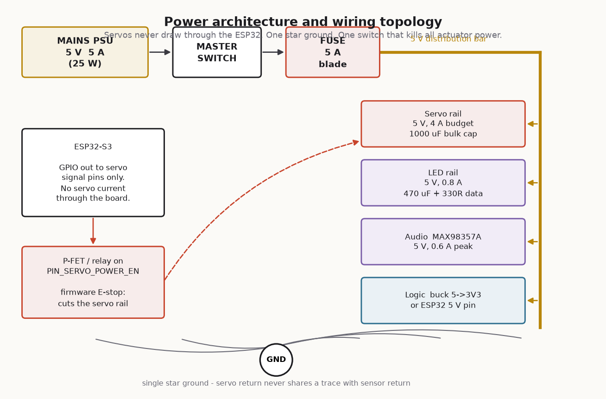

# WIRING



Complete connection table, power budget and the three wiring rules that
account for most of the failures people hit on this kind of build.

---

## 1. The three rules

**1. Servos never draw current through the ESP32.**
The dev board's 5 V pin is fed through a diode and a narrow trace. An MG996R
stalls at 2.5 A. Give the servos their own rail straight from the PSU.

**2. One star ground.**
Servo return current is spiky and large. If it shares a wire with the ToF
sensors' ground, the resulting few hundred millivolts of ground bounce shows
up as phantom range readings. All grounds meet at one bolt/bar, and only there.

**3. The master switch cuts actuator power, not logic.**
When something jams you want the motors dead and the display still telling you
why. The master switch and the GPIO38 soft-cutoff both act on the servo rail.

---

## 2. Power budget

Measured/datasheet worst case, main controller:

| Load | Qty | Idle | Moving | Stall / peak |
|---|---:|---:|---:|---:|
| MG996R — lid | 1 | 10 mA (detached) | 500–900 mA | 2500 mA |
| MG90S — eye pan | 1 | 5 mA | 150 mA | 700 mA |
| MG90S — eye tilt | 1 | 5 mA | 150 mA | 700 mA |
| SG90 — finger | 1 | 5 mA | 130 mA | 650 mA |
| SG90 — hatch | 1 | 5 mA | 130 mA | 650 mA |
| WS2812B ×12 | 12 | — | 220 mA @ brightness 90 | 720 mA all-white |
| MAX98357A + 4 Ω | 1 | 3 mA | 300 mA | 900 mA transient |
| ESP32-S3 + sensors + OLED | — | 90 mA | 240 mA (Wi-Fi TX) | 500 mA |

**Realistic simultaneous worst case** — lid moving, eye tracking, LEDs on,
audio playing: roughly **2.4 A**.
**Absolute worst case** with every servo stalled: about **6.5 A**, which the
firmware never commands and the mechanical stops prevent.

Specify a **5 V 5 A (25 W)** supply. That gives 2× headroom on the realistic
case and rides out the stall transients on the bulk capacitance.

> The firmware detaches idle servos (`LID_IDLE_DETACH_MS`, `EYE_IDLE_DETACH_MS`),
> so between interactions the whole machine sits at roughly 350 mA. This is
> also why the bin is silent when idle — a parked-but-attached analogue servo
> hunts and buzzes.

---

## 3. Power distribution

```
      ┌──────────────┐
      │  5 V / 5 A   │
      │   PSU        │
      └──────┬───────┘
             │  2.5 mm² / 14 AWG
      ┌──────┴───────┐
      │ MASTER SWITCH│   (DPST, 10 A — breaks 5 V to actuators)
      └──────┬───────┘
             │
      ┌──────┴───────┐
      │  FUSE 5 A    │   blade fuse in a panel holder
      └──────┬───────┘
             │
      ╞══════╪══════════════════════════════╡  5 V distribution bar
             │
   ┌─────────┼──────────┬─────────────┬──────────────┐
   │         │          │             │              │
   ▼         ▼          ▼             ▼              ▼
SERVO      LED        AUDIO        LOGIC          spare
RAIL       RAIL       RAIL         RAIL
(via       470 µF     220 µF       ESP32 5V pin
 P-FET)    + 330R                  or buck to 3V3
1000 µF    on data
```

### Decoupling — do not skip this

| Where | Part | Why |
|---|---|---|
| Servo rail, at the distribution point | 1000 µF, 10 V electrolytic, low-ESR | Absorbs servo inrush. Without it the ESP32 browns out the first time the lid moves. |
| Servo rail, at each servo connector | 100 nF ceramic | Local HF decoupling. |
| LED rail, at the first pixel | 470 µF, 10 V | WS2812 strips draw in sharp steps. |
| LED data line | 330 Ω series | Damps reflections, protects the first pixel's input. |
| Audio rail | 220 µF + 100 nF | MAX98357A pulls hard on bass transients. |
| ESP32 3V3, near the module | 10 µF + 100 nF | |

---

## 4. Connection table — main controller

### 4.1 Servos (5 pin-headers, JST-style or 0.1" 3-pin)

| Servo | Signal → GPIO | + | − |
|---|---|---|---|
| Lid (MG996R) | 4 | Servo rail 5 V | Star GND |
| Eye pan (MG90S) | 5 | Servo rail 5 V | Star GND |
| Eye tilt (MG90S) | 6 | Servo rail 5 V | Star GND |
| Finger (SG90) | 7 | Servo rail 5 V | Star GND |
| Hatch (SG90) | 15 | Servo rail 5 V | Star GND |

Signal wires carry only a few mA — 26 AWG is fine. Power wires to the lid
servo should be 20 AWG or heavier.

### 4.2 Servo rail cutoff (GPIO38)

A high-side P-channel MOSFET switch, driven by a small N-FET so the logic is
the right way up:

```
                     5 V rail in
                          │
                  ┌───────┴────────┐
             ┌────┤ S   P-FET (e.g. IRF4905, AO3401 for low current)
             │    │ G           D ├────► SERVO RAIL OUT
             │    └───────┬────────┘
          10k│            │
             │            │
   GPIO38 ──[1k]──┤ G  N-FET (2N7002 / 2N7000)
                  │ S ── GND
```

- GPIO38 **HIGH** → N-FET on → P-FET gate pulled low → servo rail **on**.
- GPIO38 **LOW / floating / ESP32 unpowered** → servo rail **off**.

That last line is the point: the safe state is the default state.

For currents above ~3 A, use a proper high-side load switch or an automotive
relay instead of a small SOT-23 P-FET.

### 4.3 I²C bus

| Device | SDA | SCL | VIN | GND | Addr |
|---|---|---|---|---|---|
| VL53L0X — throat | 8 | 9 | 3V3 | Star GND | 0x30 |
| VL53L0X — approach | 8 | 9 | 3V3 | Star GND | 0x31 |
| SSD1306 OLED | 8 | 9 | 3V3 | Star GND | 0x3C |

Plus `XSHUT`: throat → GPIO47, approach → GPIO48.

One pair of 4.7 kΩ pull-ups to **3V3** total for the whole bus. Adafruit
VL53L0X breakouts include 10 kΩ pull-ups; three modules in parallel gives
~3.3 kΩ, which is still fine at 400 kHz over short wires. Keep the I²C run
under 300 mm, and route it away from the servo power wires — twisting SDA/SCL
with a ground wire helps if you must run them alongside.

### 4.4 Switches and buttons

All are wired **switch → GPIO, other side → GND**, with the internal pull-up
enabled in firmware. No external resistors needed.

| Signal | GPIO | Type | Wiring note |
|---|---|---|---|
| Lid closed limit | 10 | SPDT microswitch | Use **COM → GND, NC → GPIO** so a severed wire reads "not closed". |
| Lid open limit | 11 | SPDT microswitch | Same convention. |
| NORMAL MODE | 12 | 19 mm latching pushbutton | Switch contact only; the lamp is a separate pair. |
| NORMAL MODE lamp | 2 | LED in the switch body | Through an N-FET, 5 V, with the switch's own series resistor (check your part — many 19 mm switches want 12 V; use a resistor or a 12 V feed for those). |
| Hidden trigger | 13 | Micro tactile switch | Mounted where the operator's hand rests. See the demo guide. |
| IR break-beam | 14 | 3-pin IR module OUT | Powered from 3V3. If your module is 5 V-only, level-shift the output. |

### 4.5 Audio — MAX98357A

| MAX98357A | ESP32-S3 |
|---|---|
| VIN | 5 V (audio rail) |
| GND | Star GND |
| DIN | GPIO21 |
| BCLK | GPIO17 |
| LRC | GPIO18 |
| GAIN | Leave floating for 9 dB, or tie to GND for 12 dB |
| SD | Leave floating (enabled, mono L+R) |

Speaker: 4 Ω 3 W, on the `+` / `−` screw terminals. Never ground either
speaker terminal — the output is a bridge-tied load.

### 4.6 LEDs

| WS2812B strip | To |
|---|---|
| 5 V | LED rail |
| GND | Star GND |
| DIN | GPIO16 through 330 Ω |

The ESP32-S3 outputs 3.3 V logic and WS2812B nominally wants 0.7 × VDD = 3.5 V.
It usually works. If the first pixel flickers or shows the wrong colour, add a
74AHCT125 level shifter, or power the strip from 4.5 V instead of 5 V.

---

## 5. Connection table — remote

| Signal | GPIO | Wiring |
|---|---|---|
| UP / DOWN / LEFT / RIGHT / OK / OPEN / CLOSE | 0, 1, 3, 7, 10, 20, 21 | 16 mm buttons, one side to GPIO, other to GND |
| Aux ladder | 4 | See `PINOUT.md` §2.3 |
| OLED SDA / SCL | 5 / 6 | 3V3 + GND from the board |
| Status LED | 8 | Onboard, no wiring |
| SECRET | 9 | Onboard BOOT button |

Power: a 2000 mAh Li-ion cell into the board's battery input, or simply a USB
power bank in the battery compartment. The remote draws ~45 mA average, so
either lasts a full event. There is no charging circuit in this design — if
you add a TP4056, keep it away from the antenna, which is decorative and
therefore attracts curiosity.

---

## 6. Loom and strain relief

- Use JST-XH or Dupont **with locking shells** for anything that crosses a
  module boundary. A vibrating servo will walk a bare Dupont pin off its
  header in about forty lid cycles.
- Label both ends of every harness. The tray slides out with the loom
  attached; you will still need to unplug it eventually.
- Route servo power and I²C on opposite sides of the tray.
- Cable-tie the lid servo's loom to the body **with a service loop** — the
  lid moves, the loom must not be in tension at either end of travel.
- Heat-shrink every solder joint. Splices inside a machine that shakes itself
  are a failure looking for an audience.
